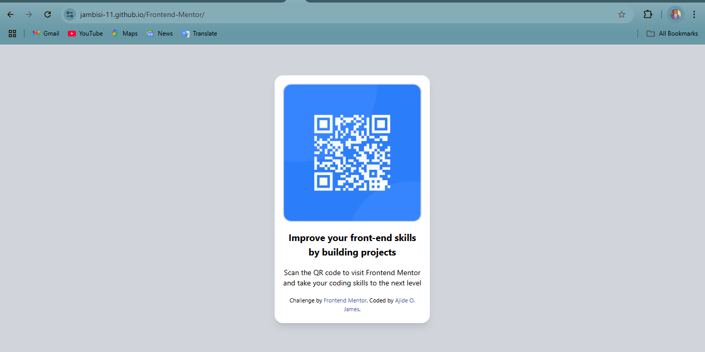

# Frontend Mentor - QR code component solution

This is a solution to the [QR code component challenge on Frontend Mentor](https://www.frontendmentor.io/challenges/qr-code-component-iux_sIO_H). Frontend Mentor challenges help you improve your coding skills by building realistic projects. 

## Table of contents

- [Overview](#overview)
  - [Screenshot](#screenshot)
  - [Links](#links)
- [My process](#my-process)
  - [Built with](#built-with)
- [Author](#author)
- [Acknowledgments](#acknowledgments)

## Overview

### Screenshot

### Links

- Solution URL: [Add solution URL here](https://github.com/Jambisi-11/Frontend-Mentor)
- Live Site URL: [Add live site URL here](https://jambisi-11.github.io/Frontend-Mentor/)

## My process

### Built with

- Semantic HTML5 markup
- Flexbox
- Taiwind CSS

## Author

- Website - [Ajide O. James](https://www.linkedin.com/in/james-olabisi-72746b11b)
- Frontend Mentor - [@yourusername](https://www.frontendmentor.io/profile/Jambisi-11)
- Twitter - [@yourusername](https://x.com/JambisO)

**Note: Delete this note and add/remove/edit lines above based on what links you'd like to share.**

## Acknowledgments

I’d like to thank Frontend Mentor for providing this challenge. It was a great opportunity to practice my skills and learn new techniques.
